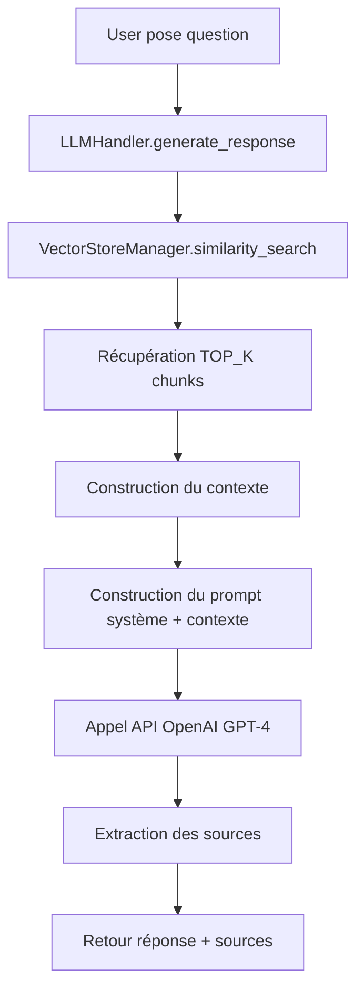

# AI-Sisters-test_technique

# ⚖️ RAG Legal Chatbot

Application de chatbot intelligent basée sur RAG (Retrieval-Augmented Generation) pour le cabinet d'avocats **Emilia Parenti**, spécialisé en droit des affaires à Paris.

---

## 📋 Table des Matières

- [Vue d'ensemble](#-vue-densemble)
- [Fonctionnalités](#-fonctionnalités)
- [Architecture](#-architecture)
- [Prérequis](#-prérequis)
- [Installation](#-installation)
- [Configuration](#-configuration)
- [Utilisation](#-utilisation)
- [Structure du Projet](#-structure-du-projet)
- [Technologies](#-technologies)
- [Dépannage](#-dépannage)
- [Licence](#-licence)

---

## 🎯 Vue d'ensemble

Ce chatbot permet aux avocats du cabinet de :
- 📄 **Uploader** des documents juridiques (contrats, notes, procédures)
- 🔍 **Rechercher** des informations spécifiques dans une base documentaire
- 💬 **Poser des questions** en langage naturel
- ✅ **Obtenir des réponses précises** avec citation des sources

Le système utilise la technique **RAG (Retrieval-Augmented Generation)** pour combiner :
1. **Recherche sémantique** dans une base vectorielle (FAISS ou ChromaDB)
2. **Génération de réponses** via GPT-4 (OpenAI)

---

## ✨ Fonctionnalités

### 📄 Gestion des Documents

- ✅ Upload de fichiers multiples (`.txt`, `.csv`, `.html`)
- ✅ Validation automatique (taille, format)
- ✅ Traitement et chunking intelligent
- ✅ Vectorisation avec embeddings OpenAI
- ✅ Suppression sélective de documents
- ✅ Statistiques en temps réel

### 💬 Interface de Chat

- ✅ Questions en langage naturel
- ✅ Réponses contextualisées avec sources
- ✅ Historique de conversation (contexte multi-tours)
- ✅ Export de conversation
- ✅ Validation des questions
- ✅ Interface moderne et responsive

### 🔧 Configuration Avancée

- ✅ Choix du vector store (FAISS ou ChromaDB)
- ✅ Configuration du modèle LLM
- ✅ Paramétrage du chunking
- ✅ Logging détaillé avec rotation
- ✅ Variables d'environnement (.env)

---

## 🏗️ Architecture
```
┌─────────────────────────────────────────────────────────────┐
│                    Interface Streamlit                       │
│  ┌──────────────────────┐  ┌────────────────────────────┐  │
│  │   💬 Chat            │  │  📄 Gestion Documents      │  │
│  │                      │  │                            │  │
│  │  - Questions         │  │  - Upload                  │  │
│  │  - Historique        │  │  - Suppression             │  │
│  │  - Sources           │  │  - Statistiques            │  │
│  └──────────────────────┘  └────────────────────────────┘  │
└─────────────────────────────────────────────────────────────┘
                              │
                              ▼
┌─────────────────────────────────────────────────────────────┐
│                      Couche Métier                           │
│  ┌──────────────────────────────────────────────────────┐  │
│  │                    LLMHandler                         │  │
│  │  - Génération de réponses                            │  │
│  │  - Gestion du contexte                               │  │
│  │  - Validation des questions                          │  │
│  └──────────────────────────────────────────────────────┘  │
│                              │                               │
│        ┌─────────────────────┴─────────────────────┐        │
│        ▼                                             ▼        │
│  ┌──────────────────────┐        ┌──────────────────────┐  │
│  │  DocumentProcessor   │        │  VectorStoreManager  │  │
│  │                      │        │                      │  │
│  │  - Extraction texte  │        │  - Recherche         │  │
│  │  - Chunking          │        │  - Ajout/Suppression │  │
│  │  - Validation        │        │  - Statistiques      │  │
│  └──────────────────────┘        └──────────────────────┘  │
└─────────────────────────────────────────────────────────────┘
                              │
                              ▼
┌─────────────────────────────────────────────────────────────┐
│                    Couche Données                            │
│  ┌──────────────────┐  ┌──────────────────┐  ┌───────────┐ │
│  │  Fichiers        │  │  Base Vectorielle │  │  OpenAI   │ │
│  │  Uploadés        │  │  (FAISS/Chroma)  │  │  API      │ │
│  │                  │  │                  │  │           │ │
│  │  /data/uploads/  │  │  /data/vector/   │  │  GPT-4    │ │
│  └──────────────────┘  └──────────────────┘  └───────────┘ │
└─────────────────────────────────────────────────────────────┘
```

### Flux de Traitement d'une Question


---

## 📦 Prérequis

### Systèmes d'Exploitation

- ✅ Windows 10/11
- ✅ macOS 12+
- ✅ Linux (Ubuntu 20.04+)

### Logiciels Requis

- **Python 3.11+** ([Télécharger](https://www.python.org/downloads/))
- **Git** (optionnel, pour cloner le repo)

### Clé API

- **OpenAI API Key** ([Obtenir une clé](https://platform.openai.com/api-keys))

### Windows Uniquement (si ChromaDB)

Si vous souhaitez utiliser **ChromaDB** au lieu de FAISS :

- **Microsoft Visual C++ Build Tools** ([Télécharger](https://visualstudio.microsoft.com/visual-cpp-build-tools/))
  - Cocher "Desktop development with C++" lors de l'installation

⚠️ **Note** : FAISS est recommandé sur Windows (pas besoin de Build Tools)

---

## 🚀 Installation

### 1️⃣ Cloner le Projet
```bash
# Via Git
git clone https://github.com/DonaldFeuz/AI-Sisters-test_technique.git
cd AI-Sisters-test_technique

# Ou télécharger le ZIP et extraire
```

### 2️⃣ Créer un Environnement Virtuel

#### Windows (PowerShell)
```powershell
python -m venv venv
.\venv\Scripts\Activate
```

#### macOS/Linux
```bash
python3 -m venv venv
source venv/bin/activate
```

### 3️⃣ Installer les Dépendances
```bash
pip install --upgrade pip
pip install -r requirements.txt
```

## ⚙️ Configuration

### 1️⃣ Créer le Fichier `.env`

Copier `.env.example` en `.env` (ou créer un nouveau fichier) :
```bash
# Windows PowerShell
Copy-Item .env.example .env

# macOS/Linux
cp .env.example .env
```

### 2️⃣ Configurer les Variables

Éditer `.env` avec vos paramètres :
```env
# =============================================================================
# CONFIGURATION - RAG Legal Chatbot
# =============================================================================

# -----------------------------------------------------------------------------
# OpenAI API
# -----------------------------------------------------------------------------
OPENAI_API_KEY=sk-proj-xxxxxxxxxxxxxxxxxxxxxxxxxxxxxxxxxxxxxxxx

# -----------------------------------------------------------------------------
# LLM Configuration
# -----------------------------------------------------------------------------
LLM_MODEL=gpt-4o                    # Modèle: gpt-4o, gpt-4-turbo-preview, gpt-3.5-turbo
LLM_TEMPERATURE=0.0                 # Température (0.0 = déterministe, 1.0 = créatif)
MAX_TOKENS=1000                     # Nombre max de tokens dans la réponse

# -----------------------------------------------------------------------------
# Embeddings Configuration
# -----------------------------------------------------------------------------
EMBEDDING_MODEL=text-embedding-3-small

# -----------------------------------------------------------------------------
# Vector Store Configuration
# -----------------------------------------------------------------------------
VECTOR_STORE_TYPE=faiss             # Type: faiss ou chroma (FAISS recommandé pour Windows)
TOP_K_RESULTS=5                     # Nombre de chunks récupérés par recherche

# -----------------------------------------------------------------------------
# Document Processing
# -----------------------------------------------------------------------------
CHUNK_SIZE=1000                     # Taille des chunks (en caractères)
CHUNK_OVERLAP=200                   # Chevauchement entre chunks
MAX_UPLOAD_SIZE_MB=10               # Taille max par fichier uploadé (MB)

# -----------------------------------------------------------------------------
# Application
# -----------------------------------------------------------------------------
APP_TITLE=RAG Legal Chatbot
APP_ICON=⚖️
```

### 3️⃣ Variables Importantes

| Variable | Description | Valeurs Possibles |
|----------|-------------|-------------------|
| `OPENAI_API_KEY` | Clé API OpenAI | `sk-proj-...` |
| `LLM_MODEL` | Modèle GPT à utiliser | `gpt-4o`, `gpt-4-turbo-preview`, `gpt-3.5-turbo` |
| `LLM_TEMPERATURE` | Créativité (0=déterministe, 1=créatif) | `0.0` à `1.0` |
| `VECTOR_STORE_TYPE` | Base vectorielle | `faiss` (recommandé), `chroma` |
| `TOP_K_RESULTS` | Chunks récupérés par recherche | `3` à `10` (recommandé: `5`) |
| `CHUNK_SIZE` | Taille des morceaux de texte | `500` à `2000` (recommandé: `1000`) |

---

## 🎮 Utilisation

### Lancer l'Application
```bash
# Depuis la racine du projet
streamlit run src/app.py
```

L'application s'ouvre automatiquement dans votre navigateur à `http://localhost:8501`

### Workflow Typique

#### 1️⃣ **Uploader des Documents**

1. Aller dans **📄 Gestion des Documents**
2. Cliquer sur **"Parcourir"**
3. Sélectionner un ou plusieurs fichiers (`.txt`, `.csv`, `.html`)
4. Cliquer sur **"🚀 Traiter et Ajouter à la Base"**
5. Attendre le traitement (barre de progression)
6. ✅ Succès : Les documents sont maintenant dans la base

#### 2️⃣ **Poser des Questions**

1. Aller dans **💬 Chat**
2. Taper une question dans le champ de saisie
3. Appuyer sur **Entrée**
4. La réponse s'affiche avec les sources utilisées
5. Poser des questions de suivi (le contexte est préservé)

#### 3️⃣ **Gérer les Documents**

- **Voir les statistiques** : Nombre de chunks, documents, etc.
- **Supprimer un document** : Cliquer sur 🗑️ à côté du document
- **Vider la base** : Utiliser le bouton "🗑️ Vider Complètement la Base"

---

## 📂 Structure du Projet
```
rag-legal-chatbot/
│
├── README.md                    # Documentation principale
├── requirements.txt             # Dépendances Python
├── .env                         # Configuration (à créer)
├── .env.example                 # Exemple de configuration
├── .gitignore                   # Fichiers ignorés par Git
│
├── src/                         # Code source
│   ├── __init__.py
│   ├── app.py                   # Point d'entrée Streamlit
│   │
│   ├── config/                  # Configuration
│   │   ├── __init__.py
│   │   └── settings.py          # Chargement variables .env
│   │
│   ├── utils/                   # Utilitaires
│   │   ├── __init__.py
│   │   ├── document_processor.py   # Traitement documents
│   │   ├── vector_store.py         # Gestion base vectorielle
│   │   └── llm_handler.py          # Intégration LLM
│   │
│   └── components/              # Composants Streamlit
│       ├── __init__.py
│       ├── chat_interface.py       # Interface de chat
│       └── document_manager.py     # Gestion documents
│
├── data/                        # Données (créé automatiquement)
│   ├── uploads/                 # Fichiers uploadés
│   └── vector_store/            # Base vectorielle
│       ├── faiss_index/         # Index FAISS
│       │   ├── index.faiss
│       │   └── index.pkl
│       └── chroma_db/           # Base ChromaDB (si utilisé)
│
└── logs/                        # Logs (créé automatiquement)
    └── app_2025-01-28.log       # Logs du jour
```

---

## 🛠️ Technologies

### Backend

| Technologie | Version | Rôle |
|-------------|---------|------|
| **Python** | 3.11+ | Langage principal |
| **Streamlit** | 1.30+ | Framework web |
| **LangChain** | 0.1+ | Orchestration LLM et RAG |
| **OpenAI API** | 1.7+ | Génération de réponses (GPT-4) |
| **FAISS** | 1.7.4 | Base vectorielle (Facebook AI) |
| **BeautifulSoup** | 4.12+ | Parsing HTML |
| **Loguru** | 0.7+ | Logging avancé |

### Embeddings et Vector Stores

- **text-embedding-3-small** : Modèle d'embeddings OpenAI (1536 dimensions)
- **FAISS** : Recherche de similarité ultra-rapide (CPU)
- **ChromaDB** : Alternative (nécessite Build Tools sur Windows)

### Modèles LLM Supportés

- ✅ **gpt-4o** (recommandé) - Dernier modèle, équilibré
- ✅ **gpt-4-turbo-preview** - Haute qualité
- ✅ **gpt-3.5-turbo** - Économique

---

## 🐛 Dépannage

### Problème : `ModuleNotFoundError: No module named 'streamlit'`

**Solution** :
```bash
# Vérifier que l'environnement virtuel est activé
.\venv\Scripts\Activate  # Windows
source venv/bin/activate  # macOS/Linux

# Réinstaller les dépendances
pip install -r requirements.txt
```

---

### Problème : `openai.error.AuthenticationError: Invalid API Key`

**Solution** :
1. Vérifier que `.env` existe et contient `OPENAI_API_KEY=sk-proj-...`
2. Vérifier que la clé est valide sur [OpenAI Platform](https://platform.openai.com/api-keys)
3. Redémarrer l'application après modification du `.env`

---

### Problème : `ImportError: DLL load failed while importing _faiss`

**Solution** (Windows) :
```bash
# Désinstaller et réinstaller FAISS
pip uninstall faiss-cpu
pip install faiss-cpu
```

Si le problème persiste :
```bash
# Installer Microsoft Visual C++ Redistributable
# https://aka.ms/vs/17/release/vc_redist.x64.exe
```

---

### Problème : `chromadb` ne s'installe pas sur Windows

**Solution** :
1. Installer [Microsoft Visual C++ Build Tools](https://visualstudio.microsoft.com/visual-cpp-build-tools/)
2. OU utiliser FAISS à la place :
```env
   VECTOR_STORE_TYPE=faiss
```

---

### Problème : L'application est lente

**Solutions** :
1. Réduire `TOP_K_RESULTS` dans `.env` (ex: `TOP_K_RESULTS=3`)
2. Réduire `CHUNK_SIZE` (ex: `CHUNK_SIZE=500`)
3. Utiliser un modèle plus rapide (ex: `LLM_MODEL=gpt-3.5-turbo`)
4. Vérifier que `@st.cache_resource` est bien utilisé dans `app.py`

---

### Problème : Réponses de mauvaise qualité

**Solutions** :
1. Augmenter `TOP_K_RESULTS` (ex: `TOP_K_RESULTS=7`)
2. Augmenter `CHUNK_OVERLAP` (ex: `CHUNK_OVERLAP=300`)
3. Utiliser un meilleur modèle (ex: `LLM_MODEL=gpt-4o`)
4. Améliorer la qualité des documents uploadés

---

### Problème : `PermissionError` lors de la suppression de fichiers

**Solution** (Windows) :
1. Fermer tous les programmes qui pourraient utiliser les fichiers
2. Redémarrer l'application Streamlit
3. Si le problème persiste, supprimer manuellement :
```powershell
   Remove-Item -Recurse -Force data/vector_store/*
```

---

## 📊 Monitoring et Logs

### Voir les Logs en Temps Réel
```bash
# Windows PowerShell
Get-Content -Path "logs/app_2025-01-28.log" -Wait

# macOS/Linux
tail -f logs/app_$(date +%Y-%m-%d).log
```

### Structure des Logs
```
2025-01-28 14:30:25 | INFO     | document_processor:process_file - 📄 Traitement de contrat.txt
2025-01-28 14:30:26 | INFO     | vector_store:add_documents - ✅ 15 chunks ajoutés
2025-01-28 14:30:30 | INFO     | llm_handler:generate_response - 💬 Question reçue: 'Quelle est...'
2025-01-28 14:30:32 | INFO     | llm_handler:generate_response - ✅ Réponse générée (250 caractères)
```

### Niveaux de Log

- `DEBUG` : Détails techniques (seulement dans les fichiers)
- `INFO` : Opérations normales
- `WARNING` : Situations inhabituelles
- `ERROR` : Erreurs nécessitant attention

---

## 🔒 Sécurité et Confidentialité

### Bonnes Pratiques

1. ✅ **Ne jamais committer `.env`** (déjà dans `.gitignore`)
2. ✅ **Ne pas partager votre clé API OpenAI**
3. ✅ **Utiliser des clés API avec quotas limités** en production
4. ✅ **Vérifier que `data/` et `logs/` sont dans `.gitignore`**
5. ✅ **Nettoyer régulièrement `data/uploads/`** (documents sensibles)

### Fichier `.gitignore` Recommandé
```gitignore
# Python
__pycache__/
*.py[cod]
*$py.class
venv/
*.so

# Environnement
.env
.env.local

# Données sensibles
data/uploads/*
data/vector_store/*
!data/uploads/.gitkeep
!data/vector_store/.gitkeep

# Logs
logs/*.log

# IDE
.vscode/
.idea/
*.swp

# OS
.DS_Store
Thumbs.db
```

---

## 🚀 Améliorations Futures

### Court Terme

- [ ] Support de formats additionnels (`.pdf`, `.docx`)
- [ ] Gestion de multiples bases vectorielles (par dossier juridique)
- [ ] Export de conversation en PDF
- [ ] Annotations et surlignage des sources

### Moyen Terme

- [ ] Authentification utilisateur (multi-utilisateurs)
- [ ] Historique persistant (base de données)
- [ ] API REST pour intégration
- [ ] Dashboard d'analytics (coûts, usage)

### Long Terme

- [ ] Fine-tuning d'un modèle spécialisé en droit français
- [ ] OCR pour documents scannés
- [ ] Recherche hybride (keyword + sémantique)
- [ ] Intégration avec système de gestion documentaire


---

## 👥 Auteurs

- **Développeur Principal** : Donald FEUZING NTEMMA
- **Client** : Cabinet d'avocats Emilia Parenti
- **Contact** : ntemmado@gmail.com

---

## 🙏 Remerciements

- [AI Siters](https://aisisters.ai/) pour ce test, une occasion d'apprendre. 
- [OpenAI](https://openai.com/) pour l'API GPT
- [LangChain](https://www.langchain.com/) pour le framework RAG
- [Streamlit](https://streamlit.io/) pour le framework web
- [Facebook AI Research](https://ai.facebook.com/) pour FAISS

**Fait avec ❤️ pour le Cabinet Emilia Parenti**